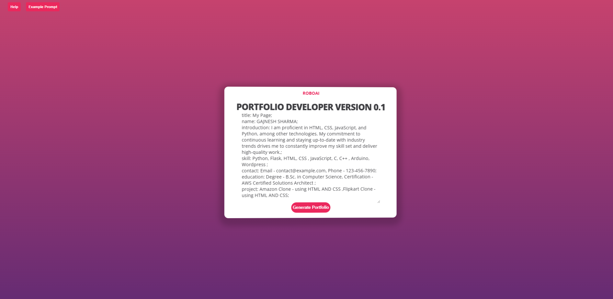
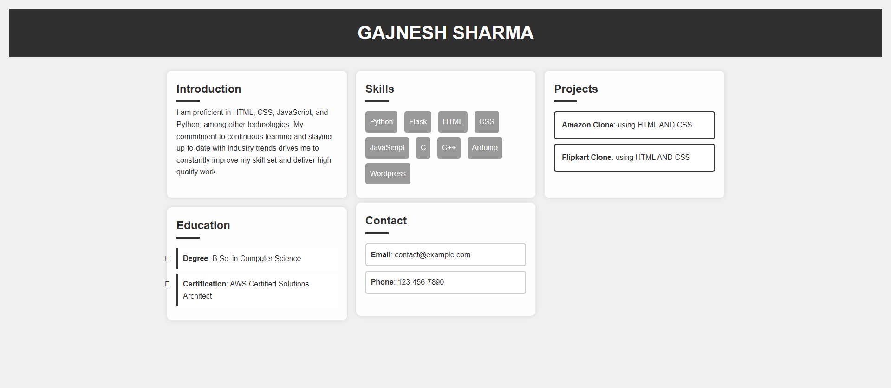
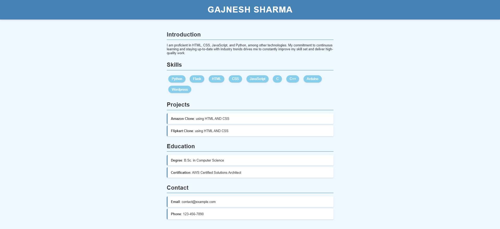


# 🧠 Portfolio Developer - v0.1

A Flask-based web app that helps users generate professional-looking portfolio pages by entering structured prompts. It supports dynamic template switching, intuitive UI, and detailed parsing of user data.

---

## ✨ Features

- ✅ Prompt-based portfolio creation
- 🎨 Random CSS themes on refresh
- 🧩 Well-structured user data parsing
- 📱 Responsive, interactive landing UI
- 🔎 Built-in help and example prompt loader

---

## 📸 Screenshots

### 🟣 Landing Page


### 🧾 Example Prompt Input



### 🧑‍💻 Generated Portfolio Page (One of the Templates)



### 🧑‍💻 Generated Portfolio Page (One of the Templates)




> 💡 Place screenshots inside a folder named `screenshots/` in the root directory of your project.

---

## 📁 Folder Structure

portfolio-developer/
│
├── static/
│ ├── style1.css
│ ├── style2.css
│ ├── style3.css
│ ├── style4.css
│ ├── style5.css
│ └── style6.css
│
├── templates/
│ └── base_template.html
│
├── screenshots/
│ ├── landing_page.png
│ ├── example_prompt.png
│ └── portfolio_output.png
│
├── app.py
└── README.md


---

## 🚀 How to Run the Project Locally

### 🛠 Prerequisites

- Python 3.6 or higher
- `pip` package manager

### 🔧 Installation Steps

1. **Clone the Repository**
   ```bash
   git clone https://github.com/yourusername/portfolio-developer.git
   cd portfolio-developer
