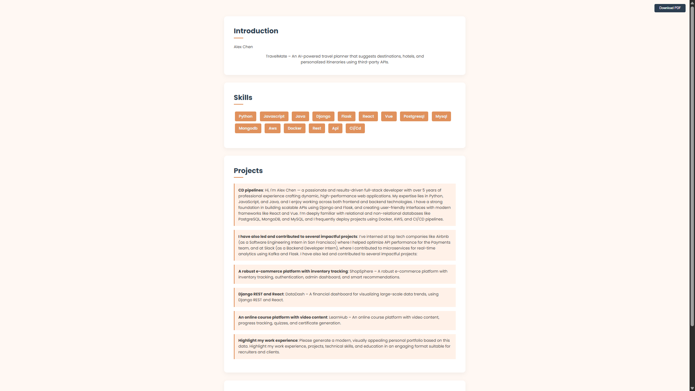

# 🧠 Portfolio Generator

Portfolio Generator is a web application that helps users create professional and customizable online portfolios. It offers flexibility through AI-powered content generation using a prompt, manual data entry, or importing project details directly from a GitHub profile. Users can select from various design templates, customize colors and fonts, and export their generated portfolio as a PDF.

---

## ✨ Features

**AI Prompt Generation**: Users can describe their profile (name, skills, projects, education, experience, contact) using a natural language prompt, and the application's NLP processor will extract relevant information to populate the portfolio.

**Manual Data Entry**: Provides a structured form for users to manually input their name, introduction, contact information, skills, experience, projects, and education details.

**GitHub Import**: Allows users to import their profile and recent public projects directly from a GitHub URL, which then generates a prompt for AI processing.

## Customization Options

***Template Styles***: Choose from 6 different templates to change the visual layout and aesthetics of the portfolio.

***Color Scheme***: Select primary and secondary colors to match personal branding.

***Font Selection***: Choose from several popular font families for the portfolio text.

***PDF Export***: Convert the generated HTML portfolio into a downloadable PDF document, suitable for sharing or printing.

---

## 📸 Screenshots

### 🟣 Home Page - Prompt Section


### 🧾 Home Page - Manual Section


### 🧑‍💻 Generated Portfolio Page (One of the Templates)


### 🧑‍💻 Generated Portfolio Page (One of the Templates)



### 🧑‍💻 Generated Portfolio Page (One of the Templates)


---

## 📁 Folder Structure
```
portfolio-generator/
├── core/
│   ├── nlp_processor.py
│   └── pdf_generator.py
├── static/
│   └── css/
│       ├── style1.css
│       ├── style2.css
│       ├── style3.css
│       ├── style4.css
│       ├── style5.css
│       └── style6.css
├── templates/
│   ├── index.html
│   └── portfolio.html
├── app.py
└── README.md
```
---

## 🚀 How to Run the Project Locally


### 🔧 Installation Steps

1. **Clone the Repository**
   ```bash
   git clone https://github.com/AYUSH-SAMADHIYA/Portfolio-Developer
   cd portfolio-developer
   ```
2. **Create a virtual environment (recommended)**
   ```bash
   python -m venv venv
   source venv/bin/activate  # On Windows: `venv\Scripts\activate`
   ```
3. **Install dependencies**
   ```bash
   pip install Flask requests weasyprint spacy
   python -m spacy download en_core_web_sm
   ```
4. **Run the application**
   ```bash
   python app.py
   ```
   The application will typically run on http://127.0.0.1:5000/
---
   
